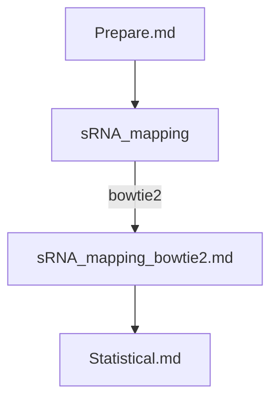

# sRNA workflow

small rna manipulating

All the processes were recorded into several markdown files.

```mermaid
graph TB
    A[Prepare.md] --> B[sRNA_mapping]
    B[sRNA_mapping] --> |bowtie2| D[sRNA_mapping_bowtie2.md]
    D --> F[Statistical.md]
```

Other analytic processes of sRNAs in plants would be recorded in different markdowns.
